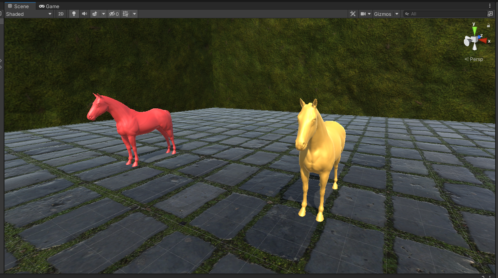
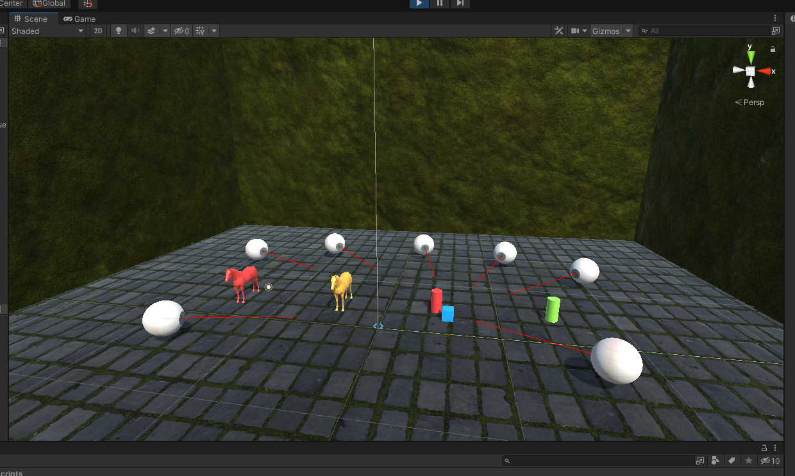
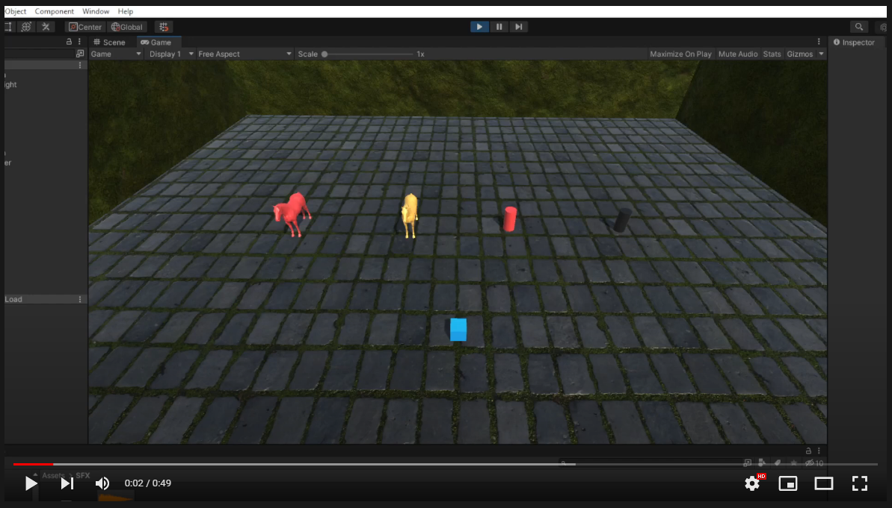

# Interfaces Inteligentes - Práctica 03 <!-- omit in toc -->

* Javier Correa Marichal (alu0101233598)
* Nerea Rodríguez Hernández (alu0101215693)
* Interfaces Inteligentes
* Universidad de La Laguna 21/22

## Tabla de contenidos <!-- omit in toc -->
- [Apartado 1](#apartado-1)
- [Apartado 2](#apartado-2)
- [Apartado 3](#apartado-3)
- [Apartado 4](#apartado-4)

## Apartado 1

> Cuando el jugador colisiona con un objeto de tipo B, el objeto A mostrará un texto en una UI de Unity. Cuando toca el objeto A se incrementará la fuerza del objeto B



Para comenzar la resolución de este apartado, se creó la clase `HorseBehaviour.cs`. En el método Start de la misma, se incluyó la inicialización necesaria para que estos objetos puedan detectar eventos disparados por otros *GameObjects* de la escena. En concreto, los caballos de tipo A están a la escucha para detectar colisiones en caballos de tipo B; y viceversa.

```csharp
public class HorseBehaviour : MonoBehaviour
{
    public Text horseText;
    public bool isHorseA, isHorseB;

    void Start()
    {
        if (isHorseA)
        {
            GameManager.instance.collisionBEvent += changeText;
            horseText.text = "";
        }
        else if (isHorseB)
        {
            GameManager.instance.collisionAEvent += changeForce;
        }
    }
```

La detección de colisiones se realiza a través del método `OnCollisionEnter()` que proporciona la API de Unity. En este método, se dispara un evento u otro en función del tipo de caballo asignado al componente.

```csharp
    private void OnCollisionEnter(Collision collision)
    {
        if (collision.gameObject.tag == "Player")
        {
            if (isHorseB) GameManager.instance.horseBCollision();
            else if (isHorseA) GameManager.instance.horseACollision();
        }
    }
```

Los eventos asociados a estas acciones se gestionan desde el componente `GameManager`, el cual fue creado para el control de las reglas del juego. Este objeto se instancia en la escena como un objeto Singleton; impidiendo que puedan coexistir dos `GameManager`:

```csharp
public delegate void CollisionDelegate();
public class GameManager : MonoBehaviour
{
    public static GameManager instance = null;
    public event CollisionDelegate collisionAEvent;
    public event CollisionDelegate collisionBEvent;

    void Awake()
    {
        if (instance == null) instance = this;
        else if (instance != this) Destroy(gameObject);
    }
```

Cuando se detecta una colisión con alguno de los dos caballos, se llama al método `horseACollision()` o `horseBCollision()`, en los cuáles se dispara el evento que corresponda:

```csharp
    public void horseACollision()
    {
        collisionAEvent();
    }

    public void horseBCollision()
    {
        collisionBEvent();
    }
```

En consecuencia, los métodos que se han suscrito a cada uno de estos eventos son también disparados por el motor de Unity.

```csharp
    private void changeText()
    {
        if (isHorseA)
        {
            horseText.text = (horseText.text == "") ? "hiiiiiiii!" : "";
        }
    }

    private void changeForce()
    {
        RepelBehaviour rb = GetComponent<RepelBehaviour>();
        rb.repelSpeed *= 2;
        Debug.Log("New repel speed: " + rb.repelSpeed);
    }
```

## Apartado 2

Para el comportamiento de los cilindros se ha implementado la clase CylinderBehaviour. En ella se pueden distinguir dos tipos de cilindros, uno tipo A y otro tipo B. 

```csharp
public class CylinderBehaviour : MonoBehaviour
{
    private GameObject player;
    public bool isTypeA, isTypeB;
    public static float minimumDistance = 7f;

    private void Awake()
    {
        player = GameObject.FindGameObjectWithTag("Player");
        if (!player) Debug.LogError("Player not found! D:");
    }

    private void Start()
    {
        if (isTypeB) GameManager.instance.proximityEvent += changeColor;
    }

    void Update()
    {
        if (isTypeA)
        {
            float distance = Vector3.Distance(transform.position, player.transform.position);
            if (distance < minimumDistance)
            {
                GameManager.instance.triggerProximity(distance);
            }
        }
    }
```

Al igual que en el apartado anterior, el comportamiento de estos cilindros es dirigdo por un evento definido en el objeto `GameManager` de la escena:

```csharp
public delegate void ProximityDelegate(float distance);
public class GameManager : MonoBehaviour
{
  // ...
  public event ProximityDelegate proximityEvent;

  public void triggerProximity(float distance)
  {
      proximityEvent(distance);
  }
```

En esta clase reside el método privado `changeColor(float distance)`, el cual recibe una distancia y es el encargado de que el cilindro de tipo B cambie del color cada vez que el jugador (Player) se acerque a un cilindro de tipo A.

```csharp
    private void changeColor(float distance)
    {
        Renderer renderer = GetComponent<Renderer>();
        renderer.material.color = Color.HSVToRGB(distance / minimumDistance, 0.73f, 0.96f);
    }
```

Se han añadido un total de siete esferas; para su control, se ha definido la clase `EyeBehaviour`:

```csharp
using System.Collections;
using System.Collections.Generic;
using UnityEngine;

public class EyeBehaviour : MonoBehaviour
{
    private GameObject player;
    private Renderer render;
    
    void Awake()
    {
        player = GameObject.FindGameObjectWithTag("Player");
        render = GetComponent<Renderer>();
    }

    private void Start()
    {
        GameManager.instance.proximityEvent += rotate;
    }

    void rotate(float distance)
    {
        if (!render.enabled)
        {
            render.enabled = true;
            GameManager.instance.spook();
        }
        transform.LookAt(player.transform.position);
    }
}
```

Las esferas se suscriben en el método `Start()` al mismo evento utilizado para cambiar el cilindro tipo B de color. En una primera instancia las esferas no se encuentran en la escena, pero las mismas apareceran cuando el jugador se aproxime al cilindro de tipo A por primera vezs. Estas esferas, tras su aparición, seguirán "con la mirada" al jugador. Para ello, se ha utilizado el método `LookAt()` de la clase `Transform`.

## Apartado 3

El controlador del jugador se ha adaptado del script desarrollado en la segunda práctica de esta asignatura. El objeto del jugador es asignado componentes `Rigidbody` y `CharacterControllerRB`. Para un mayor control sobre el movimiento del jugador, se establece el Rigidbody con la opción *isKinematic* a `True`.

```csharp
public class CharacterControllerRB : MonoBehaviour
{
    public float translationSpeed = 5f;
    public float rotationSpeed = 100f;
    
    private Rigidbody rb;

    void Awake() {
        rb = GetComponent<Rigidbody>();
    }

    void FixedUpdate()
    {
        Vector3 mInput = new Vector3(Input.GetAxis("Horizontal"), 0f, Input.GetAxis("Vertical"));
        rb.MovePosition(rb.position + mInput * Time.deltaTime * translationSpeed);
        if (Input.GetKeyDown("e"))
        {
            rb.velocity = new Vector3(rb.velocity.x, 15f, rb.velocity.z);
        }
    }
}
```

## Apartado 4

La clase `Debug` contiene métodos para facilitar la depuración mientras se desarrolla un juego. El método `DrawRay()` de esta clase dibuja una línea recta, al cual debemos pasarle tres parámetros. El primero representa la posición del comienzo de la línea, el segundo la posición del final de la línea, y por último el color de la línea.

Este método ha sido de utilidad para comprobar que nuestras esferas estaban siguiendo la dirección correcta en el ejercicio anterior.



Para la implementación del método en la clase EyeBehaviour se ha añadido una linea de código en el método rotate de la clase:

```csharp
    void rotate(float distance)
    {
        // ...
        transform.LookAt(player.transform.position);
        Debug.DrawRay(transform.position, transform.forward * 10f, Color.red);
    }
```

[](https://youtu.be/WyCQLH5cidw)
